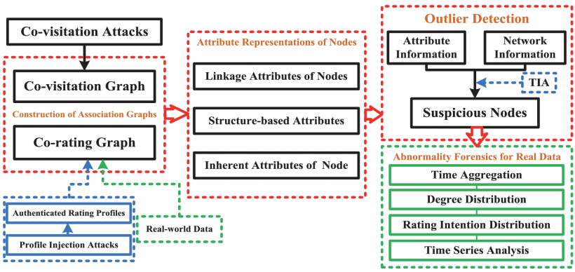
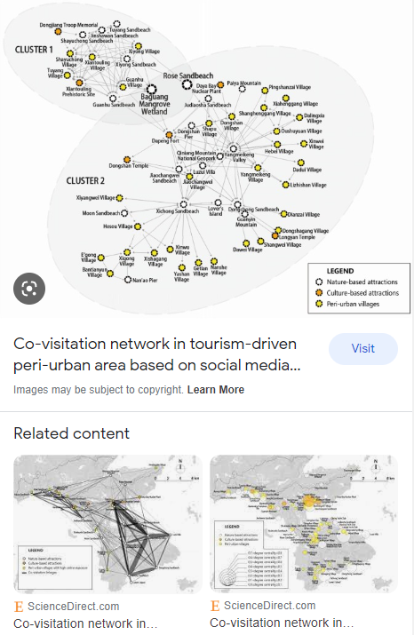

# kaggle2023-multi-objective-recommender
- TASK: Multi-category classifiers(8classes in news dataset) 전자 상거래 로그 기반(클릭, 장바구니 추가) 주문 예측
- Dataset: 독일 전자상거래 OTTO data set <br>
- Evaluation:  Recall@20 for each action type, and the three recall values are weight-averaged <br>
`Score` = 0.10 * `Recall of clicks` + 0.30 * `Recall of carts` + 0.60 * `Recall of Order`
- TASK Duration: Jan 25,2023 - Feb 01,2023 (6days) <br>
- Author: Daniel Park in South Korea https://github.com/DSDanielPark <br>
<br>
Code will be open after data de-identification and refactoring.
<br>
<br>

# References
### About Co-visitation Metric
### [1] Inference of Suspicious Co-Visitation and Co-Rating Behaviors and Abnormality Forensics for Recommender Systems <br>
<!---->
*Z. Yang, Q. Sun, Y. Zhang, L. Zhu and W. Ji, "Inference of Suspicious Co-Visitation and Co-Rating Behaviors and Abnormality Forensics for Recommender Systems," in IEEE Transactions on Information Forensics and Security, vol. 15, pp. 2766-2781, 2020, doi: 10.1109/TIFS.2020.2977023.*

<br>
<br>

### [2] Co-visitation network in tourism-driven peri-urban area based on social media analytics: A case study in Shenzhen, China
*Yao Sun, Yiwen Shao, Edwin H.W. Chan,
Co-visitation network in tourism-driven peri-urban area based on social media analytics: A case study in Shenzhen, China,
Landscape and Urban Planning,
Volume 204,
2020,
103934,
ISSN 0169-2046,
https://doi.org/10.1016/j.landurbplan.2020.103934.* <br>




<br>
<br>

# Useful Sources

|No|Description|URL|
|:---:|:---|:---|
|1| Python scikit for recommender systems | [Surprise](https://surprise.readthedocs.io/en/stable/index.html)|
|2| Python tensorflow for recommender systems | [TensorFlow Recommenders](https://github.com/tensorflow/recommenders)|
|3| A python library of evalulation metrics and diagnostic tools for recommender systems. | [Ricmetric](https://github.com/statisticianinstilettos/recmetrics) |
|4| cuDF - GPU DataFrames | [cuDF](https://github.com/rapidsai/cudf) |
|5| Stellar Graph Demos| [StellarGraph demos](https://stellargraph.readthedocs.io/en/stable/demos/index.html)|
|6| Conda Colab | [Conda Colab](https://github.com/conda-incubator/condacolab)
|7| NetworkX | [Documentation](https://networkx.org/documentation/stable/index.html)

<br>
<br>


# Tips [Optional]

## 1 About using CUDF
- Competition data size is so huge that I need to use gpu acceleration on preprocessing. This is 30x faster than using Pandas CPU
- cudf library supports only Linux OS. Cause I could't use linux server, I install 
cudf in Google Colab.
- Check rapidsai-community example on [here.](https://github.com/rapidsai-community/showcase/blob/main/getting_started_tutorials/10min_to_cudf_colab.ipynb?nvid=nv-int-tblg-386840-vt27#cid=av02_nv-int-tblg_en-us)

### 
```
!pip install cudf-cu11 --extra-index-url=https://pypi.ngc.nvidia.com
```

### 1.1 Use conda in GoogleColab
```python
>>> !nvidia-smi                          # check type of runtime
>>> !conda --version                     # check if you can use conda in kernel
/bin/bash: conda: command not found

>>> !pip install -q condacolab           # install conda colab
>>> import condacolab
>>> condacolab.install()
>>> import condacolab
>>> condacolab.check()
✨🍰✨ Everything looks OK!

```

### 1.2 Install cudf

```
!conda install -c rapidsai -c conda-forge -c nvidia \
    cudf=22.10 python=3.9 cudatoolkit=11.5
```

### 1.3 Inspite of sucessful installation, you may can see error message in importing cudf library. Change type of runtime until you can find some server that can have RAPIDS compatible GPU. 

```
ModuleNotFoundError: No module named 'cudf'
```
=> There wasn't a RAPIDS compatible GPU connected to the Colab instance.

Just remember that the RAPIDS-Colab install script will check if you have a RAPIDS compatible GPU and let you know within the first 15 seconds. Instead of erroring out, it will print out the issue and resolution steps, while NOT installing RAPIDS, as to not waste your time on something that won't work.

<br><br>

## 2. jsonl to parquet function
```python
import pandas as pd
def jsonl_to_parquet(input_jsonl_path:str, save_parquet_path: str) -> pd.core.frame.DataFrame:
    '''
    USAGE_EXAMPLE
    
    jsonl_to_parquet('../data/train.jsonl', '../data/train.parquet')
    '''
  jsonObj = pd.read_json(path_or_buf=input_jsonl_path, lines=True)
  df = pd.DataFrame(jsonObj)
  df.to_parquet(save_parquet_path)
  return jsonObj
```